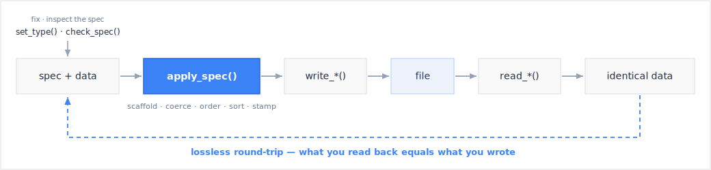

```{r}
#| include: false
library(artoo)
```

This guide walks the whole artoo round-trip once, on the bundled demo data.
A **spec** plus your **data** go through `apply_spec()`, write to a **file**,
and read back **identical** &mdash; that loop is artoo's lossless guarantee.
Every step below runs as-is; there is nothing to download.

## The round-trip at a glance

{fig-alt="A spec plus data flow into apply_spec, which scaffolds, coerces, orders, sorts, and stamps; the result writes to a file and reads back to identical data. A dashed loop labelled lossless round-trip closes from identical data back to the start, and set_type and check_spec feed in to fix and inspect the spec." width="100%"}

## 1. Get a spec

A `artoo_spec` is the canonical description of your datasets: variables,
CDISC data types, lengths, labels, controlled-terminology codelists, and
sort keys &mdash; always for exactly **one** CDISC standard. `read_spec()` reads
one from Define-XML, a Pinnacle 21 workbook, or artoo's native JSON;
`artoo_spec()` assembles one from metadata frames.

The package bundles ready-made specs built from the official CDISC
Define-XML 2.1 release examples &mdash; `adam_spec` for ADaM (ADSL, ADAE) and
`sdtm_spec` for SDTM (DM, VS, TS, SUPPDM). Each also ships as a P21
workbook you can open in Excel:

```{r}
adam_spec

p21 <- system.file("extdata", "adam-spec.xlsx", package = "artoo")
identical(spec_standard(read_spec(p21)), spec_standard(adam_spec))
```

Because `read_spec()` and `write_spec()` are inverses on each format,
format conversion is one composition &mdash; Define-XML in, P21 workbook out:

```r
read_spec("define.xml") |> write_spec("spec.xlsx")
```

## 2. Apply the spec

`apply_spec()` is the conform pipeline: it coerces each column to its CDISC
data type, orders the columns, sorts by the dataset keys, and stamps the
result with its metadata. A variable the spec declares but the data lacks is
reported, never fabricated as an empty column. The input is never mutated, no
column is ever dropped, and a coercion that would damage values aborts before
it runs &mdash; with two honest one-line exits: keep the wider source type with
`apply_spec(..., on_coercion_loss = "keep")`, or retype the spec with
`set_type()`.

```{r}
adsl <- apply_spec(cdisc_adsl, adam_spec, "ADSL")
```

The conformance findings ride along on the result &mdash; read them back as a
frame with `conformance()`:

```{r}
nrow(conformance(adsl))
```

The pipeline is standard-neutral: an SDTM domain conforms identically &mdash;
only the spec and the dataset change.

```{r}
dm <- apply_spec(cdisc_dm, sdtm_spec, "DM")
nrow(conformance(dm))
```

## 3. Inspect the columns

`columns()` is the quick look a SAS programmer expects from
`PROC CONTENTS`: one row per variable with position, type, length, format,
label, and the CDISC key sequence. It works on a conformed frame, any
plain data frame, or a file path:

```{r}
columns(adsl)
```

## 4. Write to any format — losslessly

Every writer carries the full metadata model, so the write is lossless by
construction. The writers return their input invisibly, so one conformed
frame fans out to every deliverable:

```{r}
xpt <- tempfile(fileext = ".xpt")
json <- tempfile(fileext = ".json")

adsl |>
  write_xpt(xpt) |>
  write_json(json)
```

Any file converts to any other without re-applying the spec &mdash; the
metadata travels inside (or beside) the container:

```{r}
parquet <- tempfile(fileext = ".parquet")
write_parquet(read_json(json), parquet)
```

## 5. Read back, intact

Reading restores the values, the R classes (dates as `Date`, times as
`hms`), the labels, and the metadata &mdash; identically from every format:

```{r}
back <- read_json(json)
get_meta(back)@dataset$records
columns(back)
```

One honest caveat: the XPORT byte layout stores only name, label, length,
and formats, so `columns()` on an `.xpt` path shows a blank `Key` &mdash; the
key sequence (like codelist references) rides the metadata-carrying
formats and the in-session frame, never the 1980s transport bytes.

That round-trip identity is the whole point: what you submit is what you
archived is what you analysed.

## Where to next

- [Specifications](https://vthanik.github.io/artoo/articles/specs.html) &mdash;
  read a spec from Define-XML or a workbook, inspect it with the `spec_*`
  accessors, and fix it in place with `set_type()` / `repair_spec()`.
- [Conform & validate](https://vthanik.github.io/artoo/articles/conform.html) &mdash;
  `apply_spec()` in depth, then every conformance finding from `check_spec()`
  and `check_study()`, and the errors artoo raises.
- [Formats & lossless conversion](https://vthanik.github.io/artoo/articles/convert.html) &mdash;
  any-to-any round trips, encodings, the `on_invalid` policy, and the
  qualification evidence a regulated pipeline needs.
- [Recipes](https://vthanik.github.io/artoo/articles/recipes.html) &mdash;
  end-to-end ADaM and SDTM builds, dates and `--DTC`, and codelist decoding,
  each rendered live on the demo data.
```
